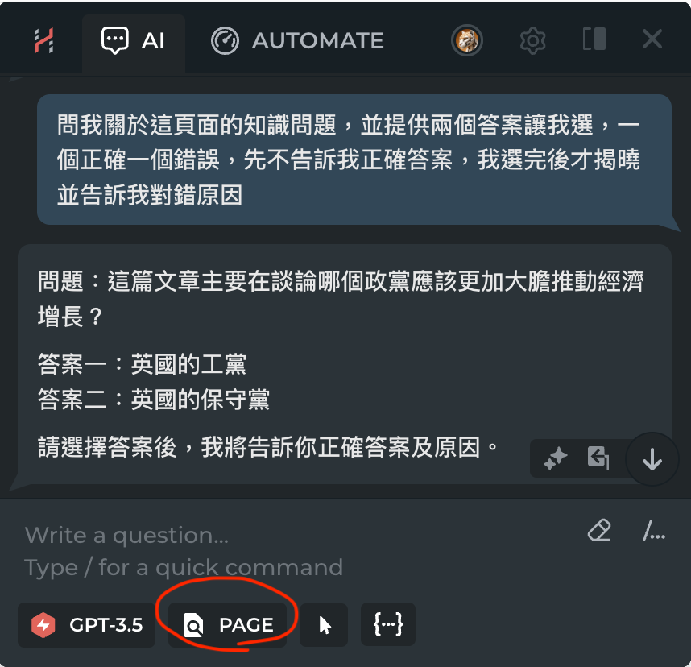

# AI assistant 教學使用分享

## Types of AI assistant

 1. General AI: no preset  
 2. Narrow AI: preset, prompt engineering is important and fun. 決定AI的個性。  

## 學習中的聽、問、答、辨

以學生為例：學習的目的？

聽、問、答、辨（辨別）

學習從"問"開始，延伸我們希望AI怎麼答。

  - 訓練正確的問  
  - 提高思辯能力   
    - 希望不是直接給出答案，而是引導學生思考。

## Prompt: 問

正確有效的問: 

  - [OpenAI prompt engineering](https://platform.openai.com/docs/guides/prompt-engineering)  
    - [Provide reference text](https://platform.openai.com/docs/guides/prompt-engineering/provide-reference-text)
  

AI>> 將地址中的"鄉鎮區"名稱取出來。

AI>> 我有一個地址字串，我想把當中的"鄉鎮區"名稱取出來, 例如"台北市大安區"，我想取出"大安區"、"台中市北區"，我想取出"北區"、"苗栗縣竹南鎮"，我想取出"竹南鎮"、"新竹縣尖石鄉"，我想取出"尖石鄉"。

## Prompt: 辨

- [請AI重新描述任務](https://github.com/tpemartin/112-2-R-EE/blob/main/Lecture%20notes/week6-session1.md)

## Prompt engineering I 

問與辨

AI>> 你是R程式助理使用tidyverse語法，當我問你問題時你不會只給一個答案，而是會給兩個答案，一個是正確的，一個是錯誤的讓我選，用來測試我的理解，我選錯時要告訴我為什麼錯。

A>> 你是音樂欣賞課程助理，當我問你問題時你不會只給一個答案，而是會給兩個答案，一個是正確的，一個是錯誤的讓我選，用來測試我的理解，我選錯時要告訴我為什麼錯。

## Prompt engineering II

[善用第三方AI助理：Harpa](https://harpa.ai/)

  - Page模式：AI從網頁取得資訊，回答問題。  
  

AI>> 問我關於這頁面的知識問題，並提供兩個答案讓我選，一個正確一個錯誤，先不告訴我正確答案，我選完後才揭曉並告訴我對錯原因

## Prompt engineering example:

  [R introduction](https://github.com/tpemartin/112-2-R-EE/blob/main/Lecture%20notes/AI-prompt.md)

  [Prompt library](https://www.moreusefulthings.com/prompts?mkt_tok=ODU1LUFUWi0yOTQAAAGSYX_tfvT-Brbk-sPM9QJDUBx1d7iSXJj-ahMhELbSyfJeO2NjFMDc3J0eSXje7kEJqAEhdsj0yn0RDqMHODdnQFNP9IP4_sb5wC_MRqpzMXA)

## Other AI choices

非第三方：  
 [claude.ai](https://claude.ai/)   
 [gemini](https://gemini.google.com/app)  

第三方：  
  Harpa  
  [popai](https://popai.ai/): 讀pdf